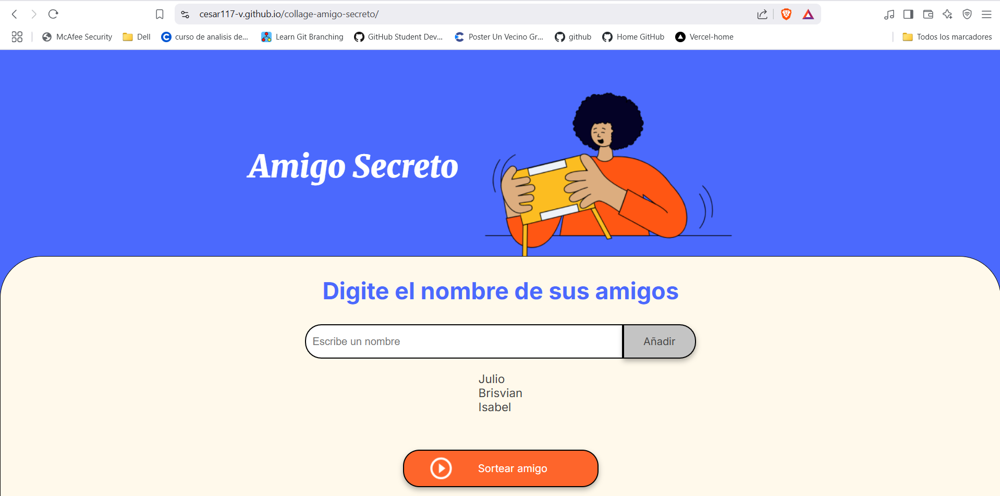
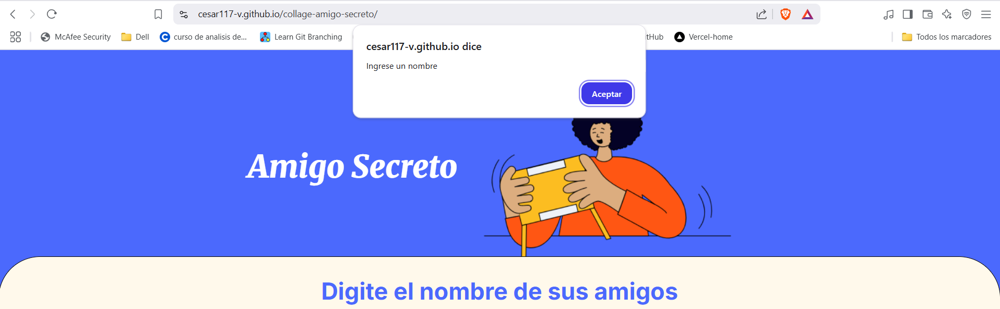

# Challenge amigo secreto.

Hola soy Julio cesar y esta es mi actividad de one sobre el challenge "Amigo Secreto". 

Ahora explicare punto por punto como funciona mi proyecto.

1.-Lo primero que tenemos hacer es escribir uno por uno los nombres de nuestros amigos en el input en donde se muestra la leyenda de "Escribe un nombre", y con el boton "Añadir", estos nombres se motraran en forma de columna abajo del input: 

2.-Una vez que ya terminemos de agregar a todos nuestros amigos a la lista, podes sortearlos y elegir un ganador al azar usando el boton "Sortear amigo", y nos mostrara en color ver quien es el amigo ganador, el cual en este caso es "Julio":

 

Basicamente ese es el funcionamiento de nuestro programa. 

PUNTOS EXTRA: Como puntos extra puedo mencionar dos cosas las cuales son: 

1.-En dado caso de que el usuario quiera usar el boton "Añadir" y en dado caso de que no se tenga ningun nada escrito en el input, se mostrara una alerta con la leyenda "Ingrese un nombre":

 

2.- Por otro lado en dado caso de que el usuario quiera usar el boton "Sortear amigo" sin antes hacer algun registro se mostrara una alerta con el mensaje de "Agregue un amigo antes de sortear": 

 

Para que puedan usar este proyecto pueden hacerlo mediante esta url: 

https://cesar117-v.github.io/collage-amigo-secreto/

